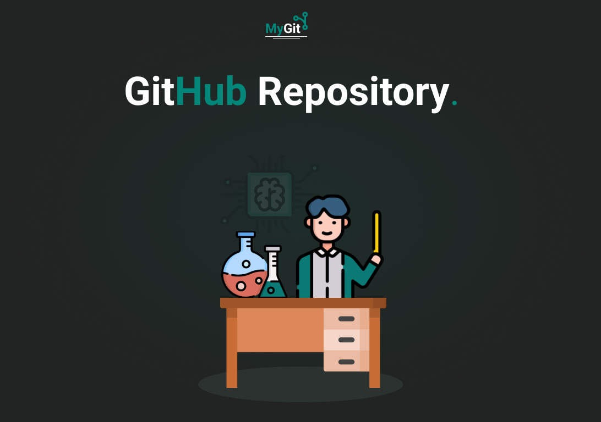

<p align='center'>
  
</p>

<div>
    
</div> 
 
 # 🧪 Tecnologias

Esse projeto foi desenvolvido com as seguintes tecnologias:
- [Context API](https://pt-br.reactjs.org/docs/context.html);
- [GitHub API](https://docs.github.com/pt/rest);
- [ReactJS](https://pt-br.reactjs.org/);
- [SASS](https://sass-lang.com/);
- [Typescript](https://www.typescriptlang.org/).

# 🚀 Como executar

Clone o projeto e acesse a pasta do mesmo.

```bash
$ git clone https://github.com/rogerrm95/github-explorer.git
$ cd github-explorer.git
```
Para iniciá-lo, siga os passos abaixo:
```bash
# Instalar as dependências
$ yarn

# Iniciar o projeto
$ yarn start
```
O app estará disponível no seu browser pelo endereço http://localhost:3000.

# 💻 Projeto

MyGit é uma plataforma no qual permite qualquer usuário a realizar uma busca por repositorios de usuários do Github. Trazendo consigo dados como: nome do projeto, descrição, topicos, URL para o repositorio no Github e até mesmo a linguagem principal utilizada em cada projeto. O projeto foi desenvolvido utilizando React JS, Context API do React, SASS e a API do Github.

Link para o projeto online: [My-Git](https://my-git-7e868.web.app/).

# 🔖 Layout

Você pode visualizar o layout do projeto através do link abaixo:
- [Layout Web](https://www.figma.com/file/cLgDIjV8Pd6P0VBaKzHEjU/GitHub-Explorer?node-id=0%3A1) (Lembrando que você precisa ter uma conta no Figma).

## 📃 License

[MIT](https://choosealicense.com/licenses/mit/)
